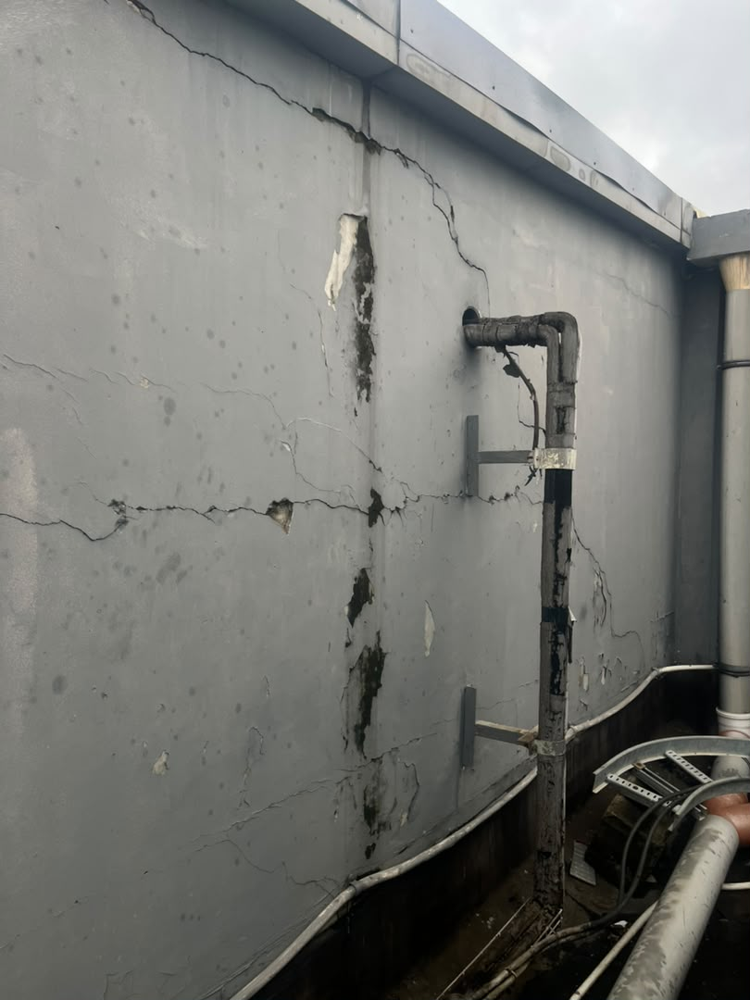

# Proposed Roof Leakage Remedial Works — Ikeja

**Status:** Internal working brief · draft only · not a client deliverable  
**Source:** “Roof Repairs Brief” ChatGPT conversation (`6a7a2634-8c78-83ea-9e7c-92d2dc71f01d`)  
**Prepared for:** Codex report and manifest drafting  
**Prepared by:** @lead/vector [codex] · 2026-08-11

## 1. Background and recommendation

Inspection identified likely water-ingress paths at the roof-edge coping/blockwork, existing fixing penetrations and the slab-to-wall junction. The recommended first response is targeted remedial work at those locations rather than immediately screeding and re-waterproofing the whole roof slab.

The works are divided into two measures intended to be carried out together:

1. **Measure 1 — coping, blockwork and associated wall repairs:** address the suspected primary leakage path, repair the cracked wall and defective coping, and reinstate local waterproofing.
2. **Measure 2 — localised slab-to-wall waterproofing:** rescreed and refelt the perimeter junction around the roof.

Full-roof screeding remains a possible later option if monitoring shows that leakage persists.

### Inspection notice and limitation of current assessment

In a case of this nature, the best solution is to locate the exact entry point and path of the water before committing to wider remedial work. The two measures set out in this brief are based solely on the visible inspection carried out to date.

**Measure 1 is the leading remedial measure.** The coping, blockwork, roof-cap and cracked-wall defects appear to be the more promising lead for the principal route of water ingress. **Measure 2 is precautionary.** It provides additional protection at the slab-to-wall junction in case water is also entering through, or travelling along, that perimeter interface.

An image of the defective wall is attached below and should be included in the eventual report. It shows signs of water damage and cracking; the cracking may be consistent with deflection movement in that section of wall, but the underlying mechanism has not yet been confirmed.

### Attached site image

*Figure 1. Defective wall observed during visible inspection. The image is evidence of observed condition only; it is not, by itself, a definitive diagnosis of the leakage path or structural cause.*

The definite cause and path of the leakage can only be established with greater confidence when the works begin and the affected areas are opened, cleaned and investigated. The final repair method, extent and sequence may therefore need to be adjusted to suit the conditions found on site.

## 2. Working geometry

- Main roof plan used for the localised treatment: **24 m × 12 m**.
- Approximate perimeter: **(24 + 12) × 2 = 72 linear metres**.
- Localised treatment width: approximately **1 m onto the slab + 1 m up/along the wall = 2 m**.
- Localised treatment area: **72 m × 2 m = approximately 144 m²**.
- Measure 1 felt allowance: **3 rolls**, treated as approximately **30 m²** for labour costing.
- Cracked-wall reference area used in earlier calculations: approximately **3.0 m × 3.6 m = 10.8 m²**.

All dimensions and quantities remain subject to site measurement before a formal quotation.

## 3. Measure 1 — coping, blockwork and associated wall repairs

### Scope

- Remove failed existing bituminous felt and defective coping where required.
- Clean and prepare exposed blockwork.
- Seal existing screw, nail and fixing penetrations.
- Investigate and repair the visibly cracked wall section.
- Apply local waterproofing to the top of the blockwork.
- Provide and install a continuous fabricated metal/aluminium roof cap or coping to reduce joints and leakage routes.
- Include transportation of labour, installation labour and associated sundries within the relevant allowances.

### Working cost schedule

| Item | Quantity / basis | Rate | Amount |
|---|---:|---:|---:|
| Bituminous felt | 3 rolls | ₦60,000/roll | ₦180,000 |
| Labour to felt | 30 m² | ₦1,800/m² | ₦54,000 |
| Bituminous primer | 1 drum | ₦28,000/drum | ₦28,000 |
| Protective aluminium coating | 2 drums | ₦32,000/drum | ₦64,000 |
| Structural / cracked-wall repair | Lump sum | — | ₦550,000 |
| Repair corrections to existing roof cap and continuous roof coping, including fabrication and installation | Lump sum | — | ₦730,000 |
| **Measure 1 working total** |  |  | **₦1,606,000** |

The ₦550,000 wall-repair allowance is to cover opening/chiselling, reinforcement or stitching where required, cement/sand, re-screeding or plastering, waterproofing admixture and making good. The ₦730,000 coping allowance is inclusive of the proposed cap/coping correction, fabrication, installation and related repair sundries; the final profile and developed sheet quantity must be confirmed on site.

## 4. Measure 2 — localised slab-to-wall waterproofing

This is a precautionary perimeter treatment only. The quoted band extends approximately **1 metre vertically up the wall and 1 metre horizontally onto the slab** along the estimated **72-metre perimeter**, giving approximately **144 m²** of treatment. It does not include screeding or refelting the full slab area because the existing felt on the main slab appeared satisfactory during the visible inspection. If opening-up and cleaning reveal that a wider treatment is required, the finding must be recorded and Broll Properties informed before additional work proceeds.

### Scope and sequence

1. Prepare and clean the slab-to-wall junction around the affected perimeter.
2. Lay a waterproof cement–sand screed, shaped to remove vulnerable sharp corners and direct water away from the wall.
3. Allow the screed to cure adequately.
4. Apply bituminous primer.
5. Torch-apply new bituminous felt with properly lapped joints and dressed terminations through the junction.
6. Seal laps and terminations and inspect the completed treatment.

**Important correction:** Measure 2 contains **no protective aluminium coating**.

### Working cost schedule

| Item | Quantity / basis | Rate | Amount |
|---|---:|---:|---:|
| Cement for screeding | 50 bags | ₦12,500/bag | ₦625,000 |
| Sharp sand | 10 tonnes | Lump-sum allowance | ₦200,000 |
| Aquaseal waterproofing admixture | 1 × 20-litre keg | ₦95,000/keg | ₦95,000 |
| Screeding labour | Lump sum | — | ₦350,000 |
| Bituminous felt | 18 rolls | ₦60,000/roll | ₦1,080,000 |
| Labour to felt | 144 m² | ₦1,800/m² | ₦259,200 |
| Bituminous primer | 5 drums | ₦28,000/drum | ₦140,000 |
| Primer application labour | Lump sum | — | ₦100,000 |
| Protective aluminium coating | None | — | ₦0 |
| **Measure 2 working total** |  |  | **₦2,849,200** |

The five-drum primer allowance and ₦100,000 primer-application allowance are carried forward from the preceding working calculation and should be confirmed against the selected product and coverage before issue.

## 5. Combined working position

| Measure | Working total |
|---|---:|
| Measure 1 — coping, blockwork and associated wall repairs | ₦1,606,000 |
| Measure 2 — localised slab-to-wall waterproofing | ₦2,849,200 |
| **Direct works subtotal** | **₦4,455,200** |
| Professional Supervision and Works — 10% | ₦445,520 |
| VAT — 7.5% | ₦367,554 |
| **Contract total** | **₦5,268,274** |

The quotation is based on the visible site inspection recorded in Report **RPT-2026-ICM-ROOF-001**. The exact leakage path, final quantities and repair sequence may change after opening-up, clean-up and site investigation.

### Payment schedule

| Stage | Trigger | Amount |
|---|---|---:|
| 60% mobilisation | Before commencement | ₦3,160,964.40 |
| 30% second payment | After Measure 1 is fully completed and Measure 2 has commenced, with cement screeding at the slab-to-wall perimeter completed | ₦1,580,482.20 |
| 10% final payment | After completion of the entire job | ₦526,827.40 |
| **Total** |  | **₦5,268,274.00** |

## 6. Proposed execution order

**Measure 1:** remove defective coping/felt → prepare blockwork → seal penetrations → repair cracked wall → prime and waterproof the blockwork top → install the continuous fabricated cap/coping.

**Measure 2:** prepare the slab-to-wall perimeter → lay and shape the waterproof screed → cure → prime → torch-apply felt → seal laps and terminations → inspect and monitor.

## 7. Items to confirm before a formal report or quotation

- Final measured coping length, developed sheet width, gauge/profile and fixing detail.
- Exact extent and repair method for the cracked wall.
- Felt roll size and effective coverage after laps and cutting.
- Sharp-sand delivered price and whether the ₦200,000 allowance remains adequate.
- Aquaseal product/dosage and whether one 20-litre keg is sufficient for the selected screed mix.
- Whether the ₦100,000 Measure 2 labour allowance is for primer application only now that aluminium coating has been removed.
- Labour, access, lifting, transport and working-hours constraints at the site.
- Any additional contingency required if opening-up reveals a wider concealed defect or a different water-entry route.

No job code has been issued. Do not file this brief as an official project record or send it externally without the principal’s approval.
